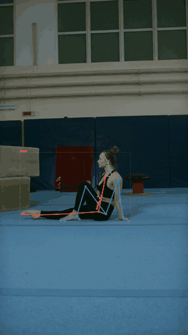
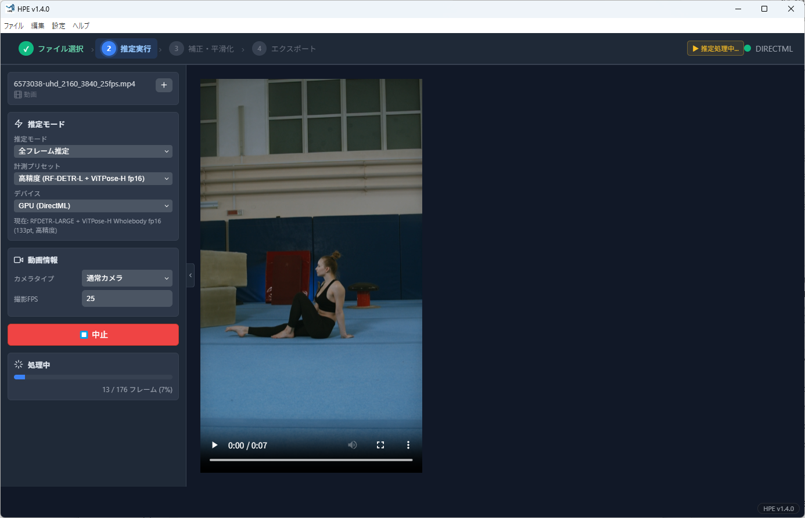
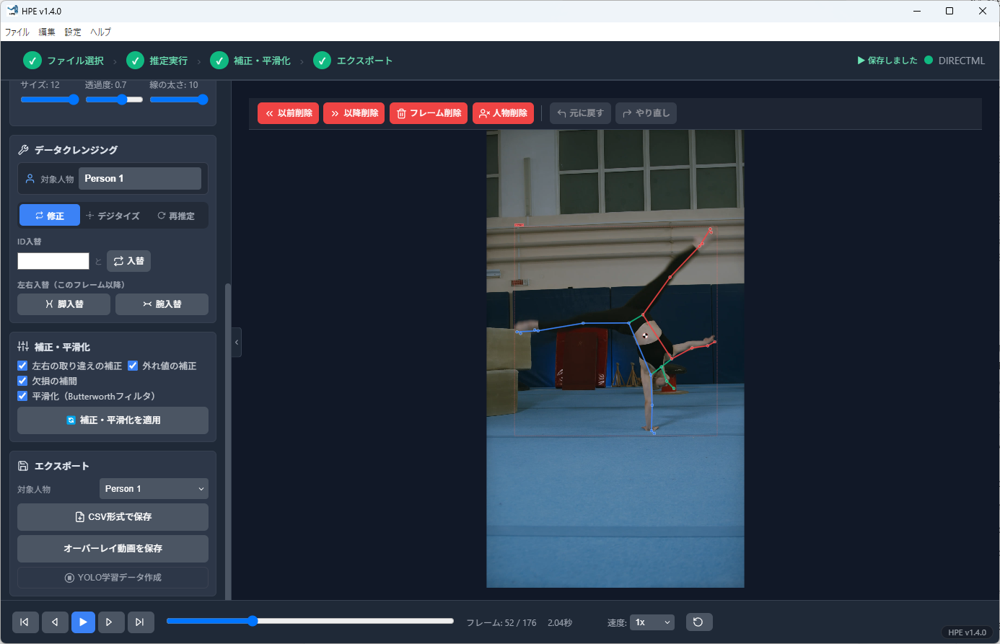

# HPE (Human Pose Estimation)

A free Windows desktop application that estimates human body keypoints (23 joint coordinates) from video and images.
No Python is required: install it and use state-of-the-art pose estimation models such as ViTPose-H.

A description in Japanese is available on [researchmap](https://researchmap.jp/blogs/blog_entries/view/804425/5667e6b4a90300bc75a2a33440a0e75f?frame_id=1462744).

**[⬇ Download the latest version (Releases)](https://github.com/SBM-Labo/HPE/releases/latest)**

  

## Screenshots

| Estimation | Correction, smoothing and export |
|---|---|
|  |  |

The user interface is in Japanese. Video used in the demo and screenshots: [Pexels](https://www.pexels.com/) (video 6573038).

## Features

- Estimates 23 body keypoints (including hand tips, foot points and the top of the head) from images and videos, for multiple people.
- Person tracking: ByteTrack (a faithful port of the original implementation) plus ID repair, which restores identities that are swapped when people cross.
- Correction and smoothing: correction of left/right mix-ups (legs, arms and feet), outlier correction, gap interpolation, and smoothing with a Butterworth filter (cut-off frequency chosen automatically by Winter's residual analysis).
- Center of mass (COM) calculation and display (body segment parameters of Ae, Okada and Yokoi).
- Skeleton overlay, time-series graphs with manual correction, and re-estimation of the current frame.
- Export to CSV, skeleton-overlay video (MP4) and images (PNG); batch processing of multiple files.

### Presets

| Preset | Person detector | Pose model | Notes |
|---|---|---|---|
| High accuracy (default) | RF-DETR-L | ViTPose-H WholeBody (fp16) | Standard for research. 6.2 px error against manual digitizing |
| Fast | RF-DETR-L | RTMPose-M + hand model | Faster than High accuracy |
| SynthPose | RTMDet-M | SynthPose-Huge | 52 anatomical markers (for research such as segment lengths) |
| Custom | Any | Any | Choose any combination of the bundled models |

## Requirements

- Windows 10 / 11 (64-bit)
- A DirectML-capable GPU is used automatically if available; otherwise HPE runs on the CPU (slower).
- At least 4 GB of free disk space (the pose estimation models take about 3.1 GB).
- The user interface is in Japanese.

## Installation

1. From [Releases](https://github.com/SBM-Labo/HPE/releases/latest), download the following **two files** and put them in the same folder (about 3 GB in total).
   - `HPE-Setup-<version>.exe` (the installer; includes the pose estimation models)
   - `synthpose-vitpose-huge-hf.onnx` (the SynthPose model; a separate file because GitHub limits each file to 2 GB. If it is in the same folder, the installer copies it automatically)
2. Run `HPE-Setup-<version>.exe`, accept the terms of use and install.
3. If Windows shows "Windows protected your PC", click **More info** → **Run anyway** (this appears because the application is not code-signed).

## Terms of use

This software is **free for research, educational and personal use**. For commercial use, please contact the author in advance.
Redistribution and modification are not permitted (linking to this page is welcome). See [LICENSE.txt](LICENSE.txt) for details.

Bundled third-party software and trained models are covered by their own licenses ([THIRD_PARTY_NOTICES.md](THIRD_PARTY_NOTICES.md), [model licenses](docs/MODEL_LICENSES.md)).
The training data of the whole-body pose models (e.g., COCO-WholeBody) is limited to research and non-commercial use. Please take care when using the software for purposes other than research and education.

## Citation

If you publish results obtained with this software, please cite it as follows ([CITATION.cff](CITATION.cff)).

> Murata, K. (2026). *HPE: Human Pose Estimation* (Version 1.4.0) [Computer software]. Zenodo. https://doi.org/10.5281/zenodo.23049885

Please state the version you used. The DOI above always resolves to the latest version; each version also has its own DOI, listed on the [Zenodo page](https://doi.org/10.5281/zenodo.23049885).

## Bug reports and contact

- Bug reports and requests: [Issues](https://github.com/SBM-Labo/HPE/issues)
- Contact: Kazutaka Murata (Faculty of Human Education, Momoyama Gakuin University), k-murata[at]andrew.ac.jp

© 2026 Kazutaka Murata (SBM_Labo)
